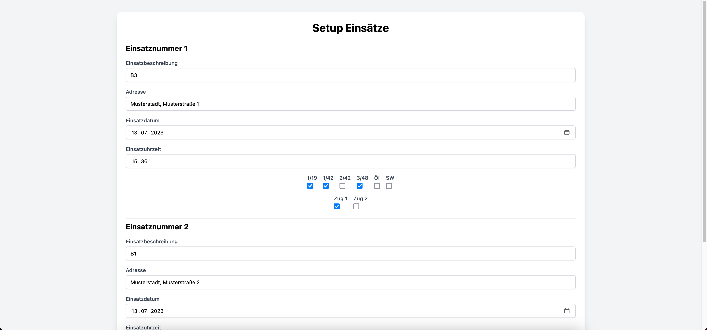

# youth-fire-fighters-24h-practice-alerting-system

In this repo a software is provided which is used by the youth fire fighters for the “Professional Firefighters' Day“ (24-hour practice).
First, a configuration can be created and then the software "alarms" at the specified times to simulate real operations.

## screenshots

### setup page:

<br/>

### alerting system in standby:

<br/>

### alerting system on alert:


## setup

Replace audio.mp3 with an alarm sound and set ``length_of_sound_in_seconds`` in line 10 in main.py to the length of the
sound file in seconds.  
Replace JF_Logo.png (2064x779px) with the logo of your own youth fire fighters logo.

## requirements

1. python 3.7.3 -> https://www.python.org/downloads/release/python-373/
2. pygame -> `pip install pygame`
3. PIL -> `pip install Pillow`

## how to use

1. open setup.php and configer all alerts there
2. start main.py

## structure of config.json

```json
[
  {
    "numberOfOperations": int
  },
  {
    "operationNumber": int,
    "operationDescription": string,
    "address": string,
    "operationDate": date
    "operationTime": time,
    "1-19": boolean,
    "1-42": boolean,
    "2-42": boolean,
    "3-48": boolean,
    "oil": boolean,
    "hoseCart": boolean,
    "unitOne": boolean,
    "unitTwo": boolean
  },
  ...
]
```
